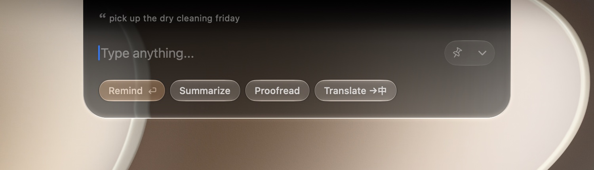

<div align="center">


# Notchi

**Your notch, always ready.**

A beautifully simple place to **ask**, **save a note**, **set a reminder**, or
**hand a task to an agent** — right from your Mac's notch.

[notch.website](https://www.notch.website) ·
[Release Notes](https://www.notch.website/releases)

Fully open source · Built in Liquid Glass · No Notchi account

<!-- Demo video: open this file in GitHub's web editor and drag the .mp4 in
     here — GitHub hosts and embeds it automatically. -->

</div>

Notchi is a free, open-source macOS app that turns the space at the top of your
screen into a place to think and act. Type one line and it can become an AI
answer, a note, a timed reminder, or a coding-agent task. There is no Notchi
account and no backend that receives your data.

## One line. Four places it can go.

Type the thought the way it arrived — half-formed is fine. Notchi can infer
whether it belongs in Ask, Notes, or Reminders; press `/` or `Tab` to choose a
destination yourself, including Agent mode.

- **Ask** — stream an answer without leaving what you are doing.
- **Note** — save something worth keeping to Apple Notes, or to daily Markdown
  files in a folder you choose.
- **Remind** — turn a time-bound thought into an Apple Reminder with its due date
  already set.
- **Agent** — give a coding task and a project folder to Codex, Claude Code, or
  Grok.


<table>
<tr>
<td></td>
<td></td>
</tr>
</table>

Copy a line anywhere on your Mac and it arrives as quoted context — ready to
summarize, proofread, translate, save, or turn into a reminder. If clipboard
sensing is enabled, copying a note or reminder candidate and pressing `⌘C`
again files it without opening the panel.

## Ask with the context that matters.

Notchi searches the web, reads useful result pages, and cites the sources it
used. It does exact arithmetic rather than guessing, renders Markdown and
LaTeX-style math cleanly, and previews linked images and PDFs inline.

Paste one or more screenshots into Ask with `⌘V` when using a vision-capable
model. Each image is visibly attached, can be removed before sending, and is
never silently picked up from the clipboard. You can also ask Notchi to search
your local record of past questions, notes, reminders, and agent tasks.

<table>
<tr>
<td></td>
<td></td>
</tr>
<tr>
<td></td>
<td></td>
</tr>
</table>

Answers stay as conversations: follow up, regenerate, copy plain text or
Markdown, pin a result, or pull the session into a standalone window. Recent
keeps the latest work close; the searchable History window keeps the rest.

## Hand it a whole task.

Notchi is also a front end for the coding agents you already use. Choose a
project folder, describe the task, and it drives your locally installed
**Codex**, **Claude Code**, or **Grok** CLI under your own sign-in and plan.
Paste screenshots or mockups into the task when they help explain the work.

The task continues while the notch is closed. Its current step and elapsed time
remain visible in the closed notch, and Notchi notifies you when it finishes or
needs attention. Agent runs live alongside chats in Recent and History, support
follow-up instructions, and can be resumed after restarting Notchi.


## Your model, your connection.

Use the AI service you prefer: OpenRouter, Vercel AI Gateway, OpenAI,
Anthropic, Google Gemini, DeepSeek, Qwen, Kimi, GLM, MiniMax, MiMo, or an
OpenAI-compatible endpoint of your own. The latter works with local and
self-hosted tools such as Ollama, LM Studio, vLLM, and gateways; its key is
optional.

You can also chat through the locally installed, signed-in Codex, Claude Code,
or Grok CLI — no API key is stored by Notchi for those connections. Model choice
is one searchable picker, with provider grouping and live catalogs where a
provider supports them. Web search can use the configured provider path, Exa,
Keenable, or AnySearch (including AnySearch's keyless anonymous tier).

## Made to disappear until you need it.

Hover the notch, use the optional menu-bar icon, or set a global summon
shortcut (double-tap `⌥` by default). Tear the composer or any conversation out
into its own window, then drag it back to the notch when you are done.

Notchi is drawn in macOS Liquid Glass — same blur, edge light, and spring — so
it feels like part of the system rather than an overlay. It works on external
displays and on Macs without a physical notch by drawing a virtual one; it can
hide that island while an external display is full-screen.

Settings cover language (English, Simplified and Traditional Chinese, Japanese,
and Korean), launch at login, appearance, shortcuts, proxies, model
connections, and the destination for notes. General also shows the live macOS
permission state for Notes automation, Reminders, and notifications, with a
direct way to grant missing access.

## Privacy

Notchi has no account, analytics, or server that stores your prompts, notes,
reminders, clipboard, or history. It routes local actions on your Mac.

For AI features, the prompt — plus only the text or images you intentionally
attach as context — goes directly from your Mac to the provider or CLI you
selected. Web-search requests go to the search service you configured. API keys
stay in local Notchi preferences; local history and attached-image copies stay
on your Mac until you delete them.

## Install

Via Homebrew:

```bash
brew install --cask cyrus-cai/lofi-lab/notchi
```

Or with the one-line installer:

```bash
curl -fsSL https://raw.githubusercontent.com/cyrus-cai/notchi/master/install.sh | bash
```

Or hand it to your coding agent — paste this into **Claude Code / Codex**:

> Please install Notchi for macOS for me. Run this in my terminal:
> `brew install --cask cyrus-cai/lofi-lab/notchi`
> It is a free, open-source menu-bar app (https://github.com/cyrus-cai/notchi).
> After it finishes, confirm Notchi is installed in /Applications and launch it.

Notchi currently ships un-notarized because I can't get through Apple's
Developer enrollment. If you have a Developer account and can help, email
[xiikii@outlook.com](mailto:xiikii@outlook.com?subject=An%20Apple%20Developer%20account%20for%20Notchi).

## Requirements

Notchi requires **macOS 14 (Sonoma) or later**. A hardware notch is optional.
Ask needs a connected AI provider or a signed-in Codex, Claude Code, or Grok
CLI. Agent mode needs the corresponding CLI installed, signed in, and a project
folder you authorize it to work in. Apple Notes, Reminders, and notifications
ask for their respective macOS permissions only when you use those features.

## Questions

**What is Notchi?**

Notchi is a macOS app that lets you type into the notch. It routes what you
write to AI, Apple Notes or Markdown files, Apple Reminders, or a coding agent
without requiring a separate app window.

**Does Notchi work on a Mac without a notch?**

Yes. On Macs without a notch and on external displays, Notchi draws a virtual
notch at the top of the display and behaves the same way.

**Do I need an account or an API key?**

Notchi itself has no account. For hosted AI, connect a provider with its API
key or supported sign-in flow. Alternatively, use Codex, Claude Code, or Grok
through a locally installed CLI that is already signed in. Notes and reminders
do not need a provider connection.

**Can I use local models?**

Yes. Add any OpenAI-compatible endpoint in Settings; this is intended for
Ollama, LM Studio, vLLM, self-hosted gateways, and providers Notchi does not
list. A key is optional for custom endpoints.

**Can I ask about screenshots or images?**

Yes, with a vision-capable Ask model. Paste images directly with `⌘V`; attach
multiple images, remove any one before sending, or send an image without typed
text. Notchi never attaches an image merely because it happens to be on your
clipboard.

**Can Notchi run Codex, Claude Code, or Grok?**

Yes. Agent mode runs the official CLI you already installed and signed in to,
inside the project folder you choose. It can keep working after the notch is
closed, accepts follow-up instructions, and exposes a one-tap resume path after
a Notchi restart.

**Where does my data go?**

Notchi does not operate a user-data backend. AI prompts and deliberately added
context go to the provider or CLI you selected; web-search requests go to the
configured search service. Notes, reminders, local history, clipboard contents,
and local files otherwise remain on your Mac.

**Why does Notchi ask for system permissions?**

Apple requires permission for Notes automation, Reminders, and notifications.
Settings → General shows each status and can open the relevant macOS prompt or
System Settings page. Choose Markdown notes to save notes in a folder without
Apple Notes automation.

**Is Notchi free?**

Yes. Notchi is free and open source, with no subscription. Any costs from an AI
provider, search service, or coding-agent plan are between you and that service.

**How do I uninstall Notchi?**

Run `brew uninstall --cask cyrus-cai/lofi-lab/notchi`, or drag Notchi out of
`/Applications`.

## Developers

Open `NotchGlass.xcodeproj` (Xcode 16+), or run `./scripts/reinstall.sh` for
the build → reinstall → relaunch loop. The model seam is `AIService.swift`; the
on-device Ask/Note router is `IntentEngine.swift`.

## License

Notchi is released under the [MIT License](LICENSE).
