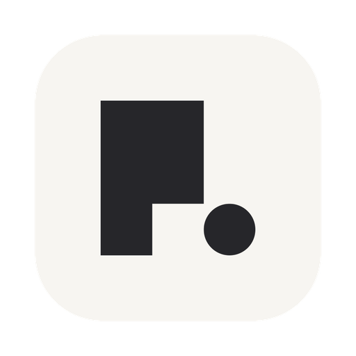

<div align="center">



# Notchi

**Your notch, always ready.**

A beautifully simple way to **save a note**, **set a reminder**, or
**ask AI** — right from your Mac's notch.

[notch.website](https://www.notch.website) ·
[Release Notes](https://www.notch.website/releases)

Fully open source · Built in Liquid Glass

<!-- Demo video: open this file in GitHub's web editor and drag the .mp4 in
     here — GitHub hosts and embeds it automatically. -->

</div>

Notchi is a free, open-source macOS app that turns the notch at the top of the
screen into a place to type. What you write becomes a note in Apple Notes, a
reminder in Apple Reminders, an AI answer under your own provider key, or a
coding-agent run on a project folder. No account, no backend.

## You type. It sorts.

Type the thought the way it arrived — half-formed is fine. Notchi reads it and
routes it: a question to AI, a note to keep, or a reminder with a time.

- **Ask** — the answer streams into the panel; you never leave what you're
  doing.
- **Note** — anything that reads like something to keep (a name, an idea, a
  number) lands in Apple Notes.
- **Remind** — anything with a time in it lands in Apple Reminders, due date
  already set.

## More than a text box.

Notchi searches the web and cites its sources, answers questions about an image
you copied, and does exact arithmetic instead of guessing at it. Copy a line
anywhere on the Mac and it rides into the panel as a quote — ready to summarize,
proofread, translate, or turn into a reminder.

## Hand it a whole task.

Notchi is also a front end for the coding agents you already have. Point it at a
project folder, type the task, and it drives your locally installed **Claude
Code**, **Codex**, or **Grok** CLI — your own sign-in, your own plan. The run
keeps going while the notch is closed: what the agent is doing on the left ear,
elapsed time on the right.

## Native, not bolted on.

Notchi is drawn in the same Liquid Glass material as the rest of macOS — same
blur, same edge light, same spring — so it feels like part of the system, not
something stuck on top.

## Your model. Your key.

Sorting happens on your Mac. Then your question goes to the provider you
picked, signed with your own key. Questions go straight to your provider —
nothing passes through our servers.

OpenAI · Anthropic · Google Gemini · DeepSeek · Qwen · Kimi · GLM · MiniMax · MiMo

## Install

Via Homebrew:

```bash
brew install --cask cyrus-cai/lofi-lab/notchi
```

Or with the one-line script:

```bash
curl -fsSL https://raw.githubusercontent.com/cyrus-cai/notchi/master/install.sh | bash
```

Or hand it to your coding agent — paste this into **Claude Code / Codex**:

> Please install Notchi for macOS for me. Run this in my terminal:
> `brew install --cask cyrus-cai/lofi-lab/notchi`
> It is a free, open-source menu-bar app (https://github.com/cyrus-cai/notchi).
> After it finishes, confirm Notchi is installed in /Applications and launch it.

No account · No backend · Free & open source · Native to macOS

## Apple Developer account

Notchi still ships un-notarized because I can't get through Apple's enrollment.
If you have a Developer account and can help, email
[xiikii@outlook.com](mailto:xiikii@outlook.com?subject=An%20Apple%20Developer%20account%20for%20Notchi).

## Requirements

Notchi requires **macOS 14 (Sonoma) or later**. A hardware notch is not
required — on a Mac without one, and on external displays, Notchi draws its own
notch in the same place. Asking AI takes an API key from a provider you choose;
running a coding agent takes the Claude Code, Codex, or Grok CLI already
installed and signed in.

## Questions

**What is Notchi?**
Notchi is a macOS app that lets you type into the notch. One text field routes
what you write to Apple Notes, Apple Reminders, an AI model, or a coding agent,
without opening another app.

**Does Notchi work on a Mac without a notch?**
Yes. On a Mac without a notch, and on external displays, Notchi draws a virtual
notch at the top of the screen and behaves the same.

**Is Notchi free?**
Yes. Notchi is free and open source, and everything it does today stays free.
There is no subscription.

**Do I need an account?**
No. Notchi has no account and no backend of its own. Notes and reminders are
written straight into Apple's own apps on your Mac.

**Do I need my own API key?**
For the AI features, yes. You paste a key from OpenAI, Anthropic, Google Gemini,
DeepSeek, Qwen, Kimi, GLM, MiniMax, or MiMo, and requests go from your Mac
directly to that provider. Notes and reminders need no key.

**Can Notchi run Claude Code or Codex?**
Yes. Notchi runs the official Claude Code, Codex, or Grok CLI already installed
on your Mac, under your own sign-in, and shows the run's live status in the
closed notch.

**Where does my data go?**
Nowhere but the provider you picked. Notchi has no servers, no accounts, and no
analytics; your clipboard, prompts, notes, and reminders stay on your Mac.

**How do I uninstall Notchi?**
`brew uninstall --cask cyrus-cai/lofi-lab/notchi`, or drag Notchi out of
`/Applications`.

## Developers

Open `NotchGlass.xcodeproj` (Xcode 16+), or run `./scripts/reinstall.sh` for
the build → reinstall → relaunch loop. The model seam is `AIService.swift`;
the on-device Ask/Note router is `IntentEngine.swift`.

## License

Notchi is released under the [MIT License](LICENSE).
