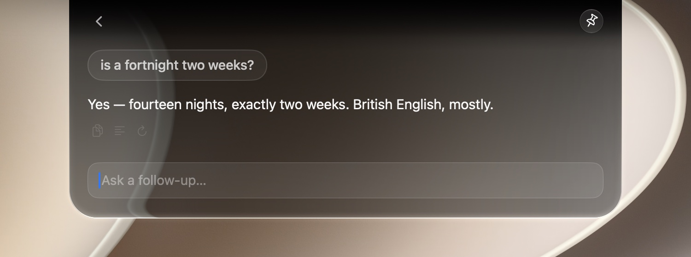
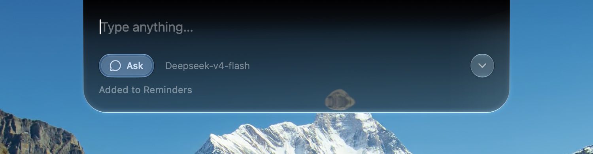
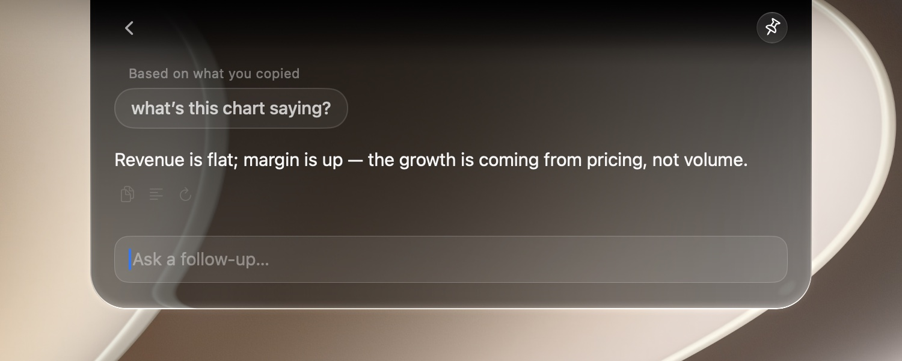
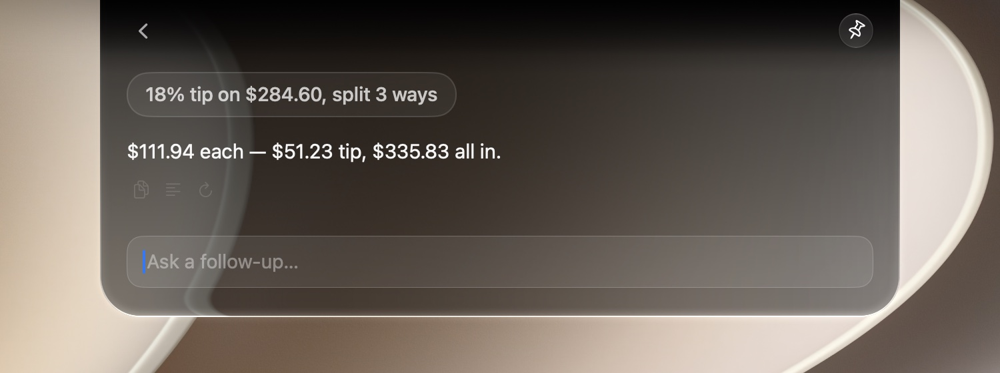
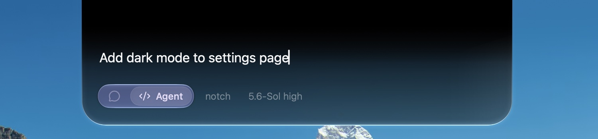
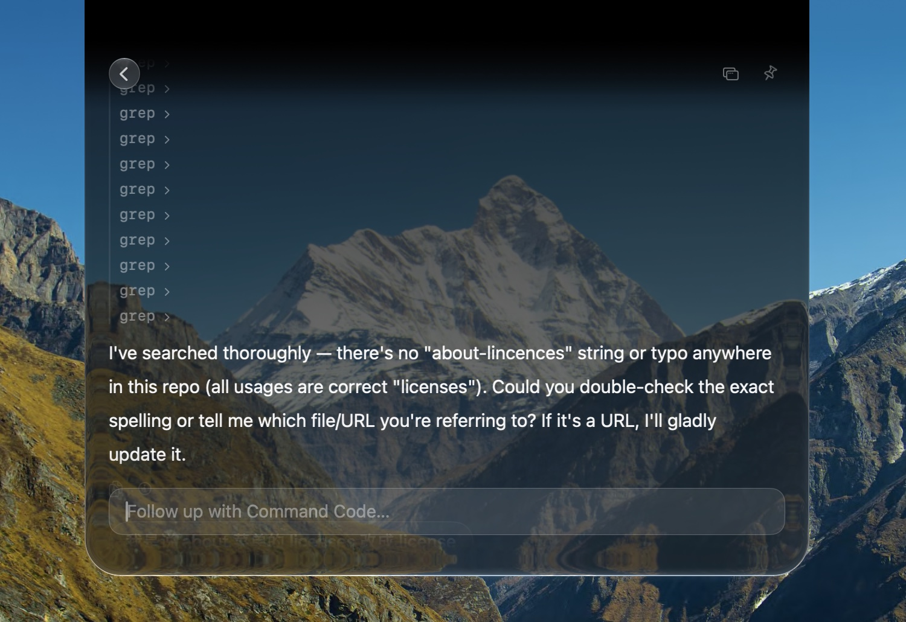

[English](README.md) · [简体中文](README.zh-CN.md)

<div align="center">


# Notchi

**刘海，随时待命。**

**提问**、**笔记**、**提醒**，或者**将任务委推给 AI** —— 一切在 Mac 的刘海中完成。

[notch.website](https://www.notch.website) ·
[更新日志](https://www.notch.website/releases)

MIT · Apple Liquid Glass

</div>

Notchi 是一款免费、开源的 macOS 应用，它从 notch 变为思考和行动的地方。你的输入内容将被自动识别为 Chat，note，reminder，或编程代理任务。

## 安装

通过 Homebrew：

```bash
brew install --cask cyrus-cai/lofi-lab/notchi
```

安装脚本：

```bash
curl -fsSL https://raw.githubusercontent.com/cyrus-cai/notchi/master/install.sh | bash
```

或者粘贴至 **Claude Code / Codex**：

> 请帮我在 macOS 上安装 Notchi。在我的终端里运行：
> `brew install --cask cyrus-cai/lofi-lab/notchi`
> 它是一款免费、开源的菜单栏应用（[https://github.com/cyrus-cai/notchi）。](https://github.com/cyrus-cai/notchi）。)
> 完成后，确认 Notchi 已安装到 /Applications 并启动它。

- Notchi 要求 **macOS 14（Sonoma）或更高版本**
- 是否拥有硬件刘海屏均可。
- 目前应用尚未经过 Apple 公证，如果你有开发者账号并且愿意协助，可将您的合作要求发送至 [xiikii@outlook.com](mailto:xiikii@outlook.com?subject=An%20Apple%20Developer%20account%20for%20Notchi)。

## 意图判断：

Notchi 会自动判断输入内容：

- **提问** — 即时获取答案
- **笔记** — 内容保存到 Apple 备忘录 或 Markdown 文件
- **提醒** — 转为 Apple 提醒事项
- **代理** — 把编程任务和项目文件夹交给 Codex、Claude Code、Grok 等



|  |  |
| --- | --- |

## 内置工具：

Notchi 支持

- 网络搜索（需配置对应 API Key）
- 网页链接跳转
- 精确算术运算
- 搜索项更改

|  |  |
| --- | --- |



## Agent：

Notchi 能调用你的的**Codex**、**Claude Code**、**Grok** 等 CLI，支持连续指令及断点继续等能力。





## BYOK：

- AI 服务：
  - 包括且不仅限于：OpenRouter、Vercel AI Gateway、OpenAI、Anthropic、Google Gemini、DeepSeek、Qwen、Kimi、GLM、MiniMax、MiMo，或你自己的 OpenAI 兼容端点
  - 你还可以通过本地安装的、已登录的 Codex、Claude Code、Grok 或 PI CLI
- 网络搜索
  - 包括但不仅限于：Exa、Keenable 或 AnySearch

## 设计：

Notchi 采用 macOS Liquid Glass 绘制 —— 包括 macOS 26原生风格的边缘光感和物理动效。

## 隐私

- Notchi 无需账号登陆。
- 提示词、聊天、笔记、提醒、agent 会话剪贴板、历史记录均存在本地，或直接请求你配置的 AI 提供商。notchi 不中转任何请求内容。

## 常见问题

**Notchi 能在没有刘海屏的 Mac 上使用吗？**

可以。在没有刘海屏的 Mac 上和外接显示器上，Notchi 会在显示器顶部绘制一个虚拟刘海，行为完全一致。

**我需要账号或 API 密钥吗？**

Notchi 本身没有账号。对于托管的 AI，请连接一个服务商并提供其 API 密钥或受支持的登录流程。或者，通过本地已登录的 CLI 使用 Codex、Claude Code、Grok 或 PI。笔记和提醒不需要连接服务商。

**我能使用本地模型吗？**

可以。在设置中添加任意 OpenAI 兼容端点；这适用于 Ollama、LM Studio、vLLM、自托管网关，以及 Notchi 未列出的服务商。自定义端点的密钥是可选的。

**我能针对截图或图片提问吗？**

可以，使用具备视觉能力的提问模型。

**Notchi 能运行 Codex、Claude Code、Grok 或 PI 吗？**

可以。代理模式在你选择的项目文件夹内，运行你已经安装并登录的官方 CLI。

**我的数据去了哪里？**

Notchi 不运营用户数据后端。AI 提示词和主动添加的上下文会发送到你选择的服务商或 CLI；网络搜索请求会发送到配置的搜索服务。除此之外，笔记、提醒、本地历史、剪贴板内容和本地文件都保留在你的 Mac 上。

**为什么 Notchi 要请求系统权限？**

**Notchi** 需要获取 Notes 自动化、提醒事项和通知的权限。设置 → 通用会显示每一项授权的状态。

**如何卸载 Notchi？**

运行 `brew uninstall --cask cyrus-cai/lofi-lab/notchi`

## 开发者

打开 `NotchGlass.xcodeproj`（Xcode 16+），或运行 `./scripts/reinstall.sh` 。

## 许可证

Notchi 以 [MIT 许可证](LICENSE) 发布。
